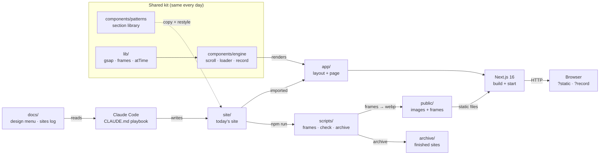
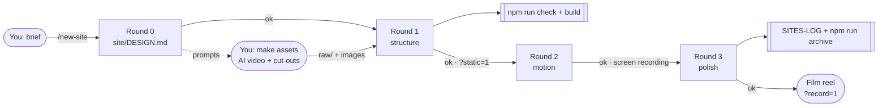
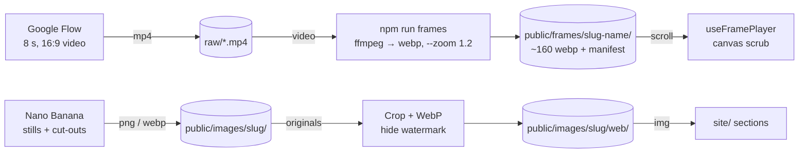
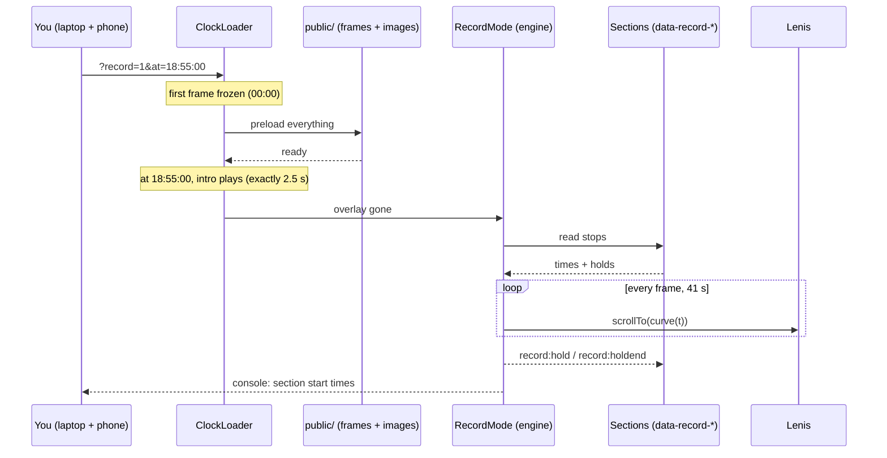

# Showreel Kit

Build **one premium showcase website a day**, each with a **completely different design**. Film it scrolling by itself on a laptop with a phone held vertically (9:16), post it as an Instagram Reel, and win clients.

- **The engine stays the same:** smooth scrolling, scroll-scrubbed video, loader, custom cursor, reveal animations, and a **record mode** that scrolls the page on a fixed timeline for filming.
- **The design is new every time:** Claude Code designs each site from scratch (layout, nav, fonts, cards, page flow), using the pattern library as ingredients and a design menu so no two days look alike.

Current site: **Meridian**, a (fictional) luxury watch maison. Day 1, archived as `archive/day-01-meridian`. Concept websites by **bilalsalmani.in**.

---

## Contents

1. [Tech stack](#tech-stack)
2. [Setup](#setup)
3. [Run it](#run-it)
4. [How the project fits together](#how-the-project-fits-together)
5. [Folder map](#folder-map)
6. [Daily workflow: one site a day](#daily-workflow-one-site-a-day)
7. [Asset pipeline](#asset-pipeline)
8. [Record mode (filming)](#record-mode-filming)
9. [Engine features (data attributes)](#engine-features-data-attributes)
10. [Pattern library](#pattern-library)
11. [Commands](#commands)
12. [Diagrams](#diagrams)
13. [Pushing to GitHub](#pushing-to-github)
14. [Deploying](#deploying)
15. [Notes](#notes)

---

## Tech stack

| Part | Used for |
|---|---|
| **Next.js 16** (App Router, Turbopack) + **React 19** | the site (one page `/` plus the pattern catalogue `/patterns`) |
| **TypeScript** | everything |
| **Tailwind CSS 4** | styling; theme colours come from `site/site.ts` as CSS variables |
| **GSAP 3 + ScrollTrigger** | scroll-driven animation, pinning, scrubbing |
| **Lenis** | smooth scrolling, synced with ScrollTrigger |
| **ffmpeg-static** | `npm run frames`: video → WebP image sequence |
| **sharp** (bundled with Next.js) | image cropping / conversion |
| **Fontsource** | self-hosted fonts per site (Meridian: Bodoni Moda + Manrope) |
| **Claude Code** | designs and builds each site, following `CLAUDE.md` and the `/new-site` skill |

## Setup

**Requirements**

- **Node.js 20.9 or newer** (Next.js 16 requires it; developed on Node 24)
- **npm** (developed on npm 11)
- **Google Chrome** for filming (record mode and the FAQ animation are tuned for Chrome)
- Optional: **Claude Code** to build new sites (`/new-site`)

**Install**

```bash
git clone <your-repo-url> showreel-kit
cd showreel-kit
npm install
```

npm 11 may skip dependency install scripts and print `npm warn install-scripts ffmpeg-static…`. That script downloads the ffmpeg binary that `npm run frames` needs. If `npm run frames` later complains that ffmpeg is missing, allow the script and rebuild:

```bash
npm install-scripts approve ffmpeg-static
npm rebuild ffmpeg-static
```

Check that everything the current site uses is present:

```bash
npm run check      # → "All assets found."
```

## Run it

```bash
npm run dev                    # while editing → http://localhost:3000
npm run build && npm start     # production: use this for filming
```

| URL | What you see |
|---|---|
| `http://localhost:3000/` | today's site (Meridian) |
| `http://localhost:3000/patterns` | the pattern library |
| `/?static=1` | no motion: layout review (Round 1) |
| `/?record=1` | record mode: hides cursor + scrollbar, then scrolls the page on its timeline |
| `/?record=1&at=18:55:00` | synced start: the loader waits frozen until that time on the device clock |

## How the project fits together

Only `site/` (and that site's folders in `public/`) changes each day. Everything else is shared.



- `app/page.tsx` renders the engine (Loader, SmoothScroll, Animations, RecordMode, Cursor) plus `site/Page.tsx`.
- `app/layout.tsx` reads `site/site.ts` (colours become CSS variables) and imports `site/fonts.ts` and `site/site.css`.
- **Rule:** never edit `components/engine/` or `components/patterns/` for one site's needs. Copy the pattern into `site/components/` and restyle it.

Interactive version: [`docs/diagrams/architecture.html`](docs/diagrams/architecture.html) (see [Diagrams](#diagrams)).

## Folder map

```
site/                     ← TODAY'S SITE (rewritten every day)
  DESIGN.md                 design direction (Round 0) + build notes
  site.ts                   name, colours, fonts, record settings
  fonts.ts  site.css        fonts + custom styles for this site
  content.ts                all text and data (products, prices, copy)
  components/               this site's sections, nav, footer, loader
  Page.tsx                  puts the page together
app/                      ← Next.js entry: layout.tsx, page.tsx, patterns/page.tsx
components/engine/        ← Loader, SmoothScroll, Animations, RecordMode, Cursor, useFramePlayer (shared)
components/patterns/      ← pattern library: copy + restyle (see /patterns)
components/ui/            ← SplitText, Magnetic, Button, TiltCard
lib/                      ← gsap setup, frame loading, loader tracker, atTime (synced start), site types
scripts/                  ← video-to-frames, check-site, archive/restore
public/images/<slug>/     ← images per site
public/frames/<slug>-*/   ← scroll frames per site (WebP + manifest.json)
raw/                      ← source videos (input to npm run frames)
archive/                  ← saved sites (copies of site/)
docs/
  DESIGN-MENU.md            looks, palettes, font pairs, navs, heroes, cards, moments (the variety engine)
  SITES-LOG.md              what each day looked like, so nothing repeats
  AI-VIDEO-PROMPTS.md       Google Flow / Nano Banana prompts (hero, exploded view, cut-outs…)
  RECORDING.md              filming guide, record timeline, laptop + phone sync
  DAILY-WORKFLOW.md         who does what, one site per day
  diagrams/                 interactive Archify diagrams (+ src/*.json specs)
.claude/skills/new-site/  ← the /new-site Claude Code skill
CLAUDE.md                 ← the playbook Claude Code follows
```

## Daily workflow: one site a day

Start in Claude Code, in this folder:

```
/new-site Day 2 — Kanchi Silks, a premium saree store in Chennai. Audience: brides and families. Mood: festive, rich, graceful. Assets: none yet.
```

It works in **4 rounds** and **stops after each one for your OK**:



| Round | Claude Code does | You check |
|---|---|---|
| **0: Design direction** | Reads `SITES-LOG.md` + `DESIGN-MENU.md`, picks look / palette / fonts / nav / hero / sections / cards / signature moment / loader (at least 6 of 8 different from each of the last 3 sites), plans 9–12 sections, writes `site/DESIGN.md` with the asset prompts | approve the direction, generate the assets |
| **1: Structure** | Archives the old site, makes frames + images, installs fonts, writes `site/` (patterns copied + restyled), `npm run check` + `npm run build` | `/?static=1` on laptop and at phone width |
| **2: Motion** | Tunes the hero and signature moment; anything that needs hover/click also plays by itself on screen | send a slow screen recording |
| **3: Polish** | Readability (text ≥ 12 px), phone check, loader, clean console, record timeline, `SITES-LOG.md` row, `npm run archive -- day-NN-slug` | film it |

Then film it: [`docs/RECORDING.md`](docs/RECORDING.md). Interactive diagram: [`docs/diagrams/workflow.html`](docs/diagrams/workflow.html).

## Asset pipeline



```bash
npm run frames -- raw/hero.mp4 frames/meridian-exploded --zoom 1.2 --max 160
```

- **Video rules:** one continuous shot, 8 s, 16:9, no text, calm space on one side. Prompts are in `docs/AI-VIDEO-PROMPTS.md`.
- **`--zoom 1.2`** crops the edges to hide AI watermarks. Keep each sequence **under 15 MB** (lower `--quality` or `--max` if needed).
- **Frames options:** `--zoom 1.2` · `--start 1 --end 7` (trim) · `--max 120` (fewer frames) · `--width 1600` · `--quality 66` · `--reverse`
- **Per-site folders** (`public/images/<slug>/`, `public/frames/<slug>-<name>`) so restoring an old site still finds its assets.
- **`npm run check`** fails if any image or frame path used in `site/` is missing.

Interactive diagram: [`docs/diagrams/assets.html`](docs/diagrams/assets.html).

## Record mode (filming)

Open `http://localhost:3000/?record=1` on the **production** build. Record mode hides the cursor (from the very first frame) and the scrollbar, waits for the loader to finish, then scrolls the page by itself.

### Section timeline

When sections carry `data-record-time`, record mode gives every section a **fixed number of seconds, the same on every screen size**. A laptop recording and a phone recording line up exactly, so you can edit them side by side.

| Attribute | Meaning |
|---|---|
| `data-record-time="2.5"` | seconds to scroll from the previous stop to this one |
| `data-record-hold="5"` | seconds to stay still once it arrives |
| `data-record-align="center"` | where the element sits when it arrives: `top` (default) · `center` · `bottom` |
| `data-record-offset="-36"` | extra pixels added to the scroll position |
| `data-record-label="FAQ"` | name printed in the console |
| `…-mobile` variant of any of them | used below 768 px (e.g. `data-record-hold-mobile="2"`); a shorter mobile hold gives its spare seconds to the next move, so the total stays identical |

- **Smooth motion:** one smooth curve through all the stops. It only comes to rest at holds, the start and the end.
- **Hold events:** during a hold the stop element receives `record:hold` (`detail.duration`) and then `record:holdend`. Meridian's collection uses this to step the big card M-01 → M-04.
- **Console:** prints the plan as a table, then `[record] 13.50 s → Collection (hold)` as each section starts, then `[record] done at 41.01 s`.
- **Pages without `data-record-time`:** the old constant-speed mode is used (`&duration=30` or `&speed=200`, `record.duration` in `site/site.ts`).
- **Keys:** **R** start / pause / resume · **T** back to the top · **+ / −** speed (constant mode).

Meridian's timeline (41 s): hero hold 3 → anatomy 1.5 + 7 → statement 2 → collection 1.5 + hold 5 (phone 2) → configurator 5 → atelier 4 → figures · details · boutiques · FAQ 2.5 each → footer 1 + hold 1.

### Filming laptop + phone together



1. Turn on **Set time automatically** on both devices, and put both on the same Wi-Fi.
2. Open `http://localhost:3000/?record=1&at=18:55:00` on the laptop and `http://<laptop-ip>:3000/?record=1&at=18:55:00` on the phone (pick a time about 1 minute ahead, 24-hour clock).
3. Each device shows the loader's first frame, frozen, while it preloads everything. At the set time both play the 2.5 s intro and the same 41 s timeline (measured 23 ms apart in testing).
4. If a device hasn't finished loading at the set time, its clock keeps ticking until it's ready, and the console warns `assets not ready at start time`. Pick a later time and film again.

Full guide (camera settings, dark-room setup, editing): [`docs/RECORDING.md`](docs/RECORDING.md). Interactive diagram: [`docs/diagrams/record-mode.html`](docs/diagrams/record-mode.html).

## Engine features (data attributes)

| Attribute / class | Effect |
|---|---|
| `data-reveal` · `data-reveal="stagger"` | fade + slide up on enter (children one after another) |
| `data-split` (with `<SplitText>`) | word-by-word reveal; wrap words in `*stars*` to highlight |
| `data-parallax="0.15"` | moves slower/faster than the page |
| `data-zoom` | image slowly zooms out while it scrolls into view |
| `data-count="850"` (+ `data-prefix`, `data-suffix`, `data-decimals`) | number counts up |
| `data-cursor="View"` | label on the custom cursor |
| `data-loader` | marks a custom loader overlay; record mode waits until it's gone |
| `data-record-*` | section timeline (see above) |
| Tailwind tokens | `bg-bg` `bg-surface` `text-fg` `text-muted` `text-accent` `bg-accent` `text-accent-fg` `border-line` |
| Classes | `font-display` `eyebrow` `container-x` `section-y` `btn btn-solid` / `btn-outline` |

Scroll videos: `FrameHero` / `FrameScrub` patterns, or the `useFramePlayer(folder, canvasRef)` hook directly.

## Pattern library

Live at `/patterns`. These are **starting points**: copy into `site/components/`, rename for the brand, and change at least 3 of layout, type, card shape, colours, spacing, image shape and motion.

| Pattern | What it is |
|---|---|
| `FrameHero` | Full-screen video that plays as you scroll, with captions |
| `FrameScrub` | Pinned product video (spin / exploded view) with callouts |
| `VariantHero` | Colour switcher: product + glow + big word change colour |
| `CurvedGallery` | Endless image row bent on a curve, drifting |
| `ExpandingPanels` | Image strips; one opens wide, auto-advances |
| `ProductShowcase` | One big product at a time with sizes/colours, auto-swaps |
| `ProductGrid` | Product cards: `pop`, `photo` or `dark` style, grid or row |
| `Bento` | Mixed-size promo tiles |
| `Ticker` | Thin scrolling offer strip |
| `WaveDivider` | Wave / curve / arch / tilt / torn edge between sections |
| `PolaroidWall` | Tilted polaroid reviews |
| `Faq` | Opening questions |
| `NavPill` / `Nav` | Floating pill nav / classic bar |
| `WordmarkFooter` / `Footer` | Huge brand-name footer / classic footer |
| `Statement` `Stats` `Features` `HorizontalGallery` `Marquee` `Split` `Parallax` `Testimonials` `Cta` | Cinematic stock sections |

## Commands

| Command | What it does |
|---|---|
| `npm run dev` | run the site while you edit |
| `npm run build && npm start` | production version (**use this when filming**) |
| `npm run frames -- <video> <folder> [options]` | turn a video into scroll frames |
| `npm run check` | check every image/frame used in `site/` exists |
| `npm run archive -- day-02-kanchi` | save the current `site/` into `archive/` |
| `npm run restore -- day-02-kanchi` | bring a saved site back (current one goes to `archive/_last`) |

## Diagrams

The four diagrams above are also interactive HTML files made with **Archify**: pan/zoom, search, focus, light/dark theme, presentation mode and export.

| Diagram | File | Source spec |
|---|---|---|
| Architecture | [`docs/diagrams/architecture.html`](docs/diagrams/architecture.html) | `docs/diagrams/src/architecture.json` |
| Daily workflow | [`docs/diagrams/workflow.html`](docs/diagrams/workflow.html) | `docs/diagrams/src/workflow.json` |
| Record mode | [`docs/diagrams/record-mode.html`](docs/diagrams/record-mode.html) | `docs/diagrams/src/record-mode.json` |
| Asset pipeline | [`docs/diagrams/assets.html`](docs/diagrams/assets.html) | `docs/diagrams/src/assets.json` |

GitHub shows `.html` files as code. To view them:
- **Locally:** open the file in a browser (`open docs/diagrams/architecture.html` on macOS).
- **Online:** turn on GitHub Pages (Settings → Pages → Deploy from branch → `main` / `/docs`), then visit `https://<user>.github.io/<repo>/diagrams/architecture.html`.

To change a diagram, edit its JSON in `docs/diagrams/src/` and ask Claude Code to re-render it with the **archify** skill (it runs `archify deliver <type> <spec>.json <output>.html --quality showcase`).

## Pushing to GitHub

```bash
git init
git add .
git commit -m "Showreel Kit: engine, pattern library, Meridian (Day 1)"
git branch -M main
git remote add origin https://github.com/<user>/<repo>.git
git push -u origin main
```

- `.gitignore` excludes `node_modules/`, `.next/`, `out/`, `*.tsbuildinfo`, `next-env.d.ts`, `.DS_Store`, `raw/*.mov` and your personal `.claude/settings.local.json`.
- The repo is about **27 MB** without `node_modules` (mostly `public/frames/` ≈ 15 MB, `raw/hero.mp4` ≈ 6 MB and the four diagram HTML files ≈ 3 MB). Every file is under GitHub's 100 MB limit. If many sites pile up, move `raw/` videos out of git or use Git LFS.
- `.claude/skills/new-site/` is committed on purpose: it's the `/new-site` command for the whole team.

## Deploying

The site is a standard Next.js app (`/` and `/patterns` are prerendered as static pages).
- **Vercel:** import the repo; the defaults (`npm run build`) work.
- **Any Node host:** `npm run build && npm start` (port 3000, or set `PORT`).

For filming, running it locally with `npm run build && npm start` is the most reliable option.

## Notes

- **Concept sites.** Prices are samples, and every site keeps a "Concept website by bilalsalmani.in" footer note. Never use a real brand's logo files or copy its real website.
- **`archive/demo-aurex`** (the original Aurex Motors demo) needs its images and frames (`public/images/road-*`, `studio-*`, `demo-car-*`, `public/frames/hero`, `public/frames/car-spin`), which are no longer in `public/`. Restoring it without them shows missing images.
- **Desktop first:** 1440×900 and 1920×1080 are the priority; phones (375 px) must not break.
